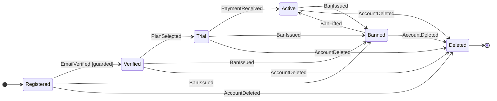

[English version](README.md)

# Tenure

イベントソーシング型エンティティライフサイクルエンジン — **Java 21+、外部依存ゼロ。**

**不正なライフサイクルが構造的に存在できない**エンティティ管理 — [8項目検証](#8項目-build-検証)がビルド時に保証。さらにイベントソーシング: 冪等性、補償、タイムトラベル。

> **Tenure** = 長期保有権。エンティティは年単位で生きる — tramli のフローは秒で完了する。Tenure は [tramli](https://github.com/opaopa6969/tramli) を時間軸に拡張したもの。

---

## 目次

- [なぜ Tenure が必要か](#なぜ-tenure-が必要か)
- [tramli vs Tenure](#tramli-vs-tenure) — 機能比較
- [クイックスタート](#クイックスタート) — 定義、生成、適用、分析
- [コアコンセプト](#コアコンセプト) — 7つの構成要素
  - [TenureEvent](#tenureevent) — ID付き不変イベント
  - [EventGuard](#eventguard) — 適用前のイベント検証（純粋関数）
  - [EntityDefinition](#entitydefinition) — ライフサイクル全体の宣言的な地図
  - [EntityInstance](#entityinstance) — イベントログを持つ生きたエンティティ
  - [LifecycleGraph](#lifecyclegraph) — 静的ライフサイクル分析
  - [MermaidGenerator](#mermaidgenerator) — コード = 図、常に最新
  - [Entry/Exit Actions](#entryexit-actions) — ライフサイクルコールバック
- [8項目 build() 検証](#8項目-build-検証) — `build()` が何をチェックするか
- [イベントガード](#イベントガード) — 適用前検証
- [イベントソーシング](#イベントソーシング) — tramli にできないこと
  - [冪等性](#冪等性) — P3
  - [補償](#補償) — P4
  - [タイムトラベル](#タイムトラベル) — stateAtVersion
  - [リビルド](#リビルド) — 状態再構築
- [Mermaid 図の自動生成](#mermaid-図の自動生成) — コード = 図、常に最新
- [ライフサイクルグラフ](#ライフサイクルグラフ) — 自動ライフサイクル依存分析
- [なぜ LLM と相性が良いか](#なぜ-llm-と相性が良いか)
- [ユースケース](#ユースケース)
- [用語集](#用語集)

---

## なぜ Tenure が必要か

tramli は**完了するフロー**をモデル化する — 注文は CREATED から SHIPPED になって終わり。しかし現実のエンティティは**年単位で生きる**:

```
ユーザーアカウント: Registered → Verified → Active → Banned → Active → Deleted
  ↑ 秒の遷移ではなく、年単位のイベント蓄積

注文フロー (tramli): CREATED → PAYMENT_PENDING → SHIPPED → 完了
  ↑ 数分で完了、FlowContext は破棄される
```

Tenure は tramli のビルド時安全性を、ライフタイムに渡ってイベントを蓄積するエンティティに持ち込む。イベントログが信頼の源泉 — 状態は常に導出される。

[DGE セッション](https://github.com/opaopa6969/tramli/tree/main/dge)からの核心的な洞察: **「データフロー検証は状態管理パラダイムに直交する。」** 可変コンテキスト（tramli）、イベントログ（Tenure）、Statecharts のいずれでも機能する。Tenure は tramli の検証をイベントソーシング型エンティティに適用することでこれを証明する。

---

## tramli vs Tenure

| 機能 | tramli | Tenure |
|------|--------|--------|
| ビルド時検証（8項目） | あり | **あり** |
| ガード検証 | TransitionGuard | **EventGuard** |
| Entry/Exit アクション | あり | **あり** |
| グラフ分析 | DataFlowGraph | **LifecycleGraph** |
| Mermaid 生成 | あり | **あり** |
| イベントソーシング | なし | **あり**（P5） |
| 冪等性 | なし | **あり**（P3） |
| 補償 | なし | **あり**（P4） |
| タイムトラベル | なし | **あり**（stateAtVersion） |
| 状態再構築 | なし | **あり**（rebuild） |
| 終端状態の強制 | あり | **あり** |
| 外部依存ゼロ | あり | **あり** |

**Tenure は tramli の上位互換。** tramli がビルド時に保証するすべてを Tenure も保証する — プラス、イベントソーシング。

---

## クイックスタート

### 1. [イベント](#tenureevent)を定義する

```java
record EmailVerified(String eventId, String email) implements TenureEvent {}
record PlanSelected(String eventId, String plan) implements TenureEvent {}
record BanIssued(String eventId, String reason) implements TenureEvent {}
record BanLifted(String eventId) implements TenureEvent {}
record AccountDeleted(String eventId) implements TenureEvent {}
```

全イベントは[冪等性](#冪等性)のための `eventId()` を持つ。同じ ID = 同じイベント = スキップ。

### 2. [エンティティライフサイクル](#entitydefinition)を定義する

```java
var userDef = Tenure.define("User", UserState::empty, "Registered")
    .terminal("Deleted")
    .onStateEnter("Banned", s -> auditLog.record("user banned"))
    .on(EmailVerified.class).from("Registered").to("Verified")
        .guard((state, event) -> event.email().contains("@")
            ? GuardResult.accepted() : GuardResult.rejected("Invalid email"))
        .apply((state, event) -> state.withEmail(event.email()))
    .on(PlanSelected.class).from("Verified").to("Trial")
        .apply((state, event) -> state.withPlan(event.plan()))
    .on(BanIssued.class).fromAny().to("Banned")
        .apply((state, event) -> state.withBan(event.reason()))
        .compensate(BanLifted.class)
    .on(BanLifted.class).from("Banned").to("Active")
        .apply((state, event) -> state.unbanned())
    .on(AccountDeleted.class).fromAny().to("Deleted")
        .apply((state, event) -> state)
    .build();  // ← ここで8項目検証
```

上から下に読めば — これ**がライフサイクル**。構造を理解するのに他のファイルは不要。

### 3. 生成して使う

```java
var user = Tenure.create(userDef, "user-001");
user.apply(new EmailVerified("ev-1", "alice@example.com"));
user.apply(new PlanSelected("ev-2", "pro"));

// 冪等: 同じ eventId は黙って無視される
user.apply(new EmailVerified("ev-1", "alice@example.com")); // no-op
```

### 4. タイムトラベル（tramli にはできない）

```java
var v1 = user.stateAtVersion(1);   // 1番目のイベント後の状態
var v0 = user.stateAtVersion(0);   // 初期状態
String name = user.stateNameAtVersion(2); // "Trial"
```

### 5. [ライフサイクル](#ライフサイクルグラフ)を分析する

```java
var graph = userDef.lifecycleGraph();
graph.reachableFrom("Registered");          // → {Verified, Trial, Active, ...}
graph.eventsAt("Verified");                 // → {PlanSelected, BanIssued, AccountDeleted}
graph.impactOf(BanIssued.class);            // → 5+ 状態に影響
graph.shortestPath("Registered", "Active"); // → [EmailVerified, PlanSelected, PaymentReceived]
graph.deadStates();                         // → {} (なし)
```

### 6. [Mermaid 図](#mermaid-図の自動生成)を生成する

```java
String mermaid = userDef.toMermaid();
```



この図は**コードから生成される** — 古くなることがない。

---

## コアコンセプト

Tenure には7つの構成要素がある。それぞれ小さく、焦点が絞られ、単独でテスト可能。

### TenureEvent

全イベントの基底インターフェース。[冪等性](#冪等性)のための ID とルーティングのための名前を持つ。

```java
public interface TenureEvent {
    String eventId();                        // 一意、冪等性のため
    default String eventName() {             // ルーティング用、デフォルトはクラス名
        return getClass().getSimpleName();
    }
}
```

イベントは**不変値オブジェクト** — 典型的には Java の record。`eventId` が重複排除キー: 同じ ID が2回適用されると、2回目は黙って無視される。

### EventGuard

イベントが適用される**前に**検証する。**純粋関数** — I/O なし、副作用なし、状態変更なし。tramli の `TransitionGuard` に相当。

```java
@FunctionalInterface
public interface EventGuard<S, E extends TenureEvent> {
    GuardResult validate(S state, E event);

    sealed interface GuardResult {
        record Accepted() implements GuardResult {}
        record Rejected(String reason) implements GuardResult {}
    }
}
```

`sealed interface` は [EntityInstance](#entityinstance) が正確に2ケースを処理することを意味する — コンパイラが `switch` でこれを強制。忘れられたエッジケースはない。

**Accepted** → イベントが適用され、状態が遷移。
**Rejected** → イベント ID は**消費されない** — 修正したデータで同じイベントをリトライ可能。

### EntityDefinition

エンティティライフサイクルの**唯一の情報源**。fluent DSL で構築され `build()` で検証される宣言的な遷移テーブル。

```java
var def = Tenure.define("Order", OrderState::empty, "Created")
    .terminal("Shipped", "Cancelled")
    .onStateEnter("Paid", s -> metrics.increment("paid-orders"))
    .on(OrderPlaced.class).from("Created").to("Pending")
        .apply((s, e) -> s.withItem(e.item()))
    .on(PaymentReceived.class).from("Pending").to("Paid")
        .guard((s, e) -> e.amount() >= s.required()
            ? GuardResult.accepted() : GuardResult.rejected("Insufficient"))
        .apply((s, e) -> s.markPaid())
    .on(OrderShipped.class).from("Paid").to("Shipped")
        .apply((s, e) -> s)
    .on(OrderCancelled.class).fromAny().to("Cancelled")
        .apply((s, e) -> s.cancelled(e.reason()))
    .build();  // ← ここで8項目検証
```

これを読むのは地図を読むようなもの — 15行でライフサイクル全体が見える。地図がコードそのもの。

### EntityInstance

追記専用イベントログを持つ生きたエンティティ。状態は**常に導出される**: `state = fold(initialState, events)`。

```java
var order = Tenure.create(orderDef, "order-001");
order.apply(new OrderPlaced("ev-1", "Widget", 100));

order.state();          // 現在の状態オブジェクト
order.stateName();      // "Pending"
order.version();        // 1（適用済みイベント数）
order.eventLog();       // 不変の EventRecord リスト
order.isTerminal();     // false
order.stateAtVersion(0); // 初期状態（タイムトラベル）
```

`apply()` は sealed な `ApplyResult` を返す:

| 結果 | 意味 |
|------|------|
| `Applied` | イベント受理、状態遷移 |
| `Duplicate` | 同じ eventId は既に適用済み — 冪等スキップ |
| `NoHandler` | 現在の状態にこのイベントのハンドラがない |
| `Terminal` | エンティティは終端状態 — これ以上の遷移不可 |
| `Rejected(reason)` | [ガード](#eventguard)がイベントを拒否 |

### LifecycleGraph

エンティティライフサイクルの静的分析。tramli の `DataFlowGraph` に相当。`def.lifecycleGraph()` で自動構築。詳細は[ライフサイクルグラフ](#ライフサイクルグラフ)を参照。

### MermaidGenerator

[EntityDefinition](#entitydefinition) から Mermaid 図を生成。詳細は [Mermaid 図の自動生成](#mermaid-図の自動生成)を参照。

### Entry/Exit Actions

状態遷移時に発火するライフサイクルコールバック。メトリクス、監査ログ、副作用に有用。

```java
.onStateEnter("Banned", state -> auditLog.record("banned: " + state.banReason()))
.onStateExit("Active", state -> metrics.decrement("active-users"))
```

アクションは [rebuild()](#リビルド) 中に**再実行されない** — 状態導出ではなく副作用だから。これは設計上の決定: リプレイは純粋でなければならない。

---

## 8項目 build() 検証

`build()` は8つの構造チェックを実行する。いずれかが失敗すると、エラーコード付きの明確なメッセージが出る — **イベントが1つも適用される前に。**

| # | チェック | 何を検出するか |
|---|---------|---------------|
| 1 | 全非終端状態が[初期](#初期状態)から[到達可能](#到達可能) | 到達不能なデッド状態 |
| 2 | [初期](#初期状態)から[終端](#終端状態)へのパスが存在 | 完了できないエンティティ |
| 3 | 曖昧なハンドラがない（同じイベント型 + 同じソース状態） | 「どのハンドラが発火する？」の混乱 |
| 4 | [補償](#補償)イベントにハンドラがある | 壊れた補償チェーン |
| 5 | [終端](#終端状態)状態に出力遷移がない | 終端であるべきなのに終端でない状態 |
| 6 | 全ターゲット状態が既知 | タイポによるダングリング参照 |
| 7 | [初期状態](#初期状態)が有効で終端でない | 欠落/壊れた開始点 |
| 8 | `fromAny` シャドウイング検出（警告） | 隠れたハンドラ優先順位バグ |

**LLM が安全に Tenure コードを生成できる理由** — 生成されたライフサイクルが誤っていても `build()` が即座に拒否する。フィードバックループ: 生成 → コンパイル → build() → 修正。ランタイムサプライズなし。

---

## イベントガード

ガードはイベントが適用される**前に**検証する — 副作用のない純粋関数:

```java
.on(PaymentReceived.class).from("Pending").to("Paid")
    .guard((state, event) -> event.amount() >= state.requiredAmount()
        ? EventGuard.GuardResult.accepted()
        : EventGuard.GuardResult.rejected("Insufficient: need " + state.requiredAmount()))
    .apply((state, event) -> state.markPaid())
```

ガードが拒否した場合:
- イベント ID は**消費されない** — 同じイベントをリトライ可能
- 状態は変化しない
- `ApplyResult.Rejected` が理由文字列付きで返される

---

## イベントソーシング

これらの機能は Tenure にあるが **tramli にはない**。Tenure が単なる移植ではなく上位互換である理由。

### 冪等性

**P3: 同じイベント ID = 同じイベント = スキップ。**

```java
user.apply(new EmailVerified("ev-1", "alice@example.com")); // → Applied
user.apply(new EmailVerified("ev-1", "alice@example.com")); // → Duplicate (no-op)
user.apply(new EmailVerified("ev-1", "bob@example.com"));   // → Duplicate (それでも no-op)
```

`eventId` が重複排除キー。イベントが一度適用されると、同じ ID は永久に無視される — ペイロードに関係なく。at-least-once 配信システム（Webhook、メッセージキュー）に不可欠。

### 補償

**P4: ロールバックではなく、追記で取り消す。**

```java
.on(BanIssued.class).fromAny().to("Banned")
    .apply((s, e) -> s.withBan(e.reason()))
    .compensate(BanLifted.class)               // ← 補償を登録
.on(BanLifted.class).from("Banned").to("Active")
    .apply((s, e) -> s.unbanned())
```

補償イベントは前方イベント — 元のイベントをログから削除しない。監査証跡は完全に残る。[ビルド時検証](#8項目-build-検証)が補償イベントにハンドラがあることを保証（チェック #4）。

### タイムトラベル

**履歴の任意の時点の状態:**

```java
user.apply(new EmailVerified("ev-1", "alice@example.com"));
user.apply(new PlanSelected("ev-2", "pro"));
user.apply(new PaymentReceived("ev-3", 1000));

var v0 = user.stateAtVersion(0);   // 初期（イベント未適用）
var v1 = user.stateAtVersion(1);   // EmailVerified 後
var v2 = user.stateAtVersion(2);   // PlanSelected 後

String s = user.stateNameAtVersion(1); // "Verified"
```

これはイベントソーシングでのみ可能 — tramli は中間状態を破棄する。監査、デバッグ、コンプライアンスに有用。

### リビルド

**イベントログから状態を再構築:**

```java
// デシリアライズ後、イベントログは復元されたが状態は古い
user.rebuild();
// 状態がイベントログと一致: state == fold(initial, events)
```

`rebuild()` は全イベントをハンドラに通して再実行する。ガードと entry/exit アクションは**再実行されない** — リビルドは純粋な状態導出。

---

## Mermaid 図の自動生成

```java
// 状態遷移図
String stateDiagram = definition.toMermaid();

// イベントフロー図（flowchart）
String eventFlow = MermaidGenerator.generateEventFlow(definition);
```

図は [EntityDefinition](#entitydefinition) **から生成される** — エンジンが使うのと同じオブジェクト。古くなることがない。

特徴:
- 終端状態は `[*]` 終了マーカー付き
- ガードは `[guarded]` で注釈
- `fromAny` 遷移は全非終端ソース状態に展開
- Entry/Exit アクションはノートとして表示
- 補償関係はノートとして表示

---

## ライフサイクルグラフ

`build()` が成功すると **LifecycleGraph** が利用可能になる — [EventHandler](#entitydefinition) 宣言から導出された状態と遷移の有向グラフ。`def.lifecycleGraph()` でアクセス。

### クエリ API

```java
LifecycleGraph graph = definition.lifecycleGraph();

// 到達可能性
graph.reachableFrom("Registered");   // 前方 BFS — どの状態に到達できるか？
graph.reachesTo("Shipped");          // 後方 BFS — どの状態からここに到達できるか？
graph.deadStates();                  // 初期から到達不能
graph.orphanStates();                // 入力遷移なし（初期を除く）

// イベント分析
graph.eventsAt("Pending");           // この状態でどのイベントが発火可能か？
graph.allEventTypes();               // ライフサイクル内の全イベント型
graph.transitionsFor(BanIssued.class); // このイベントの全遷移

// 影響分析
Impact impact = graph.impactOf(PaymentReceived.class);
// → Impact(eventType, affectedStates, transitionCount)

// パス分析
graph.shortestPath("Created", "Shipped");  // 最短イベント列
graph.requiredEventsTo("Paid");            // 初期からの最短パス上のイベント

// ガード分析
graph.guardedTransitions();          // どの遷移にガードがあるか？
```

### 完全 API リファレンス

| メソッド | 戻り値 | 説明 |
|---------|--------|------|
| `allStates()` | `Set<String>` | ライフサイクル内の全状態 |
| `initialState()` | `String` | 初期状態 |
| `terminalStates()` | `Set<String>` | 終端状態（ライフサイクルの終点） |
| `reachableFrom(state)` | `Set<String>` | 前方 BFS で到達可能な状態 |
| `reachesTo(state)` | `Set<String>` | この状態に到達可能な状態（後方 BFS） |
| `deadStates()` | `Set<String>` | 初期から到達不能な状態 |
| `orphanStates()` | `Set<String>` | 入力遷移のない状態 |
| `eventsAt(state)` | `Set<Class<?>>` | ある状態で発火可能なイベント型 |
| `allEventTypes()` | `Set<Class<?>>` | 使用される全イベント型 |
| `transitionsFor(eventType)` | `List<Transition>` | このイベントでトリガーされる遷移 |
| `outgoingFrom(state)` | `List<Transition>` | ある状態からの全出力遷移 |
| `incomingTo(state)` | `List<Transition>` | ある状態への全入力遷移 |
| `impactOf(eventType)` | `Impact` | このイベント型が変更された場合の影響を受ける状態 |
| `shortestPath(from, to)` | `List<Transition>` | 状態間の最短遷移列 |
| `requiredEventsTo(state)` | `List<Class<?>>` | 初期からの最短パス上のイベント |
| `guardedTransitions()` | `List<Transition>` | ガード付き遷移 |

### なぜこれが重要か

| ライフサイクルグラフなし | ライフサイクルグラフあり |
|------------------------|----------------------|
| 「状態 X でどのイベントが起きうる？」→ 全ハンドラを読む | `graph.eventsAt(X)` |
| 「BanIssued を変えたら何が壊れる？」→ grep | `graph.impactOf(BanIssued.class)` |
| 「デッド状態はある？」→ 手動レビュー | `graph.deadStates()` |
| 「Paid に到達する最短パスは？」→ 手で追跡 | `graph.requiredEventsTo("Paid")` |

---

## なぜ LLM と相性が良いか

| 手続き的コードの問題 | Tenure の解決策 |
|--------------------|----------------|
| 「1800行からイベントハンドラを探す」 | [EntityDefinition](#entitydefinition) を読む（20行） |
| 「変更が何かを壊さないか？」 | [LifecycleGraph.impactOf()](#ライフサイクルグラフ) |
| 「誤った状態遷移を生成した」 | [build()](#8項目-build-検証) が拒否する |
| 「ライフサイクル図が古い」 | [コードから生成](#mermaid-図の自動生成) |
| 「冪等性を処理し忘れた」 | [組み込み](#冪等性) — `eventId` の重複排除は自動 |
| 「BAN をどう取り消す？」 | [補償](#補償)は宣言的 |

**核心原則: LLM は hallucinate するが、コンパイラと `build()` はしない。**

---

## ユースケース

Tenure は**年単位で生きてイベントを蓄積するエンティティ**を持つ全てのシステムで機能する:

- **ユーザーアカウント** — 登録 → 認証 → 有効化 → 停止 → 復帰 → 削除
- **サブスクリプション** — トライアル → アクティブ → 支払い遅延 → キャンセル → 再開
- **注文** — 発注 → 支払い → 出荷 → 返品 → 返金
- **サポートチケット** — オープン → 割り当て → エスカレーション → 解決 → 再オープン → クローズ
- **デバイス / IoT** — プロビジョニング → アクティブ → ファームウェア更新 → 廃止
- **コンプライアンス** — 提出 → レビュー中 → 承認 → 監査 → 期限切れ

**短命なフロー**（OAuth、決済チェックアウト）で秒/分で完了するものは [tramli](https://github.com/opaopa6969/tramli) を使う。**長寿命のエンティティ**で履歴を蓄積するものは Tenure を使う。

---

## 用語集

| 用語 | 定義 |
|------|------|
| <a id="補償イベント"></a>**補償イベント** | 先行イベントの効果を逆転させるイベント。`.compensate()` で登録。[ビルド時検証](#8項目-build-検証)がハンドラの存在を保証。 |
| <a id="エンティティ定義"></a>**EntityDefinition** | 不変で検証済みのエンティティライフサイクルの記述。fluent DSL で構築、[build()](#8項目-build-検証) で検証。ライフサイクルの「地図」。 |
| <a id="エンティティインスタンス"></a>**EntityInstance** | 1つの生きたエンティティ。ID、イベントログ、導出された状態、現在の状態名を持つ。 |
| <a id="イベントログ"></a>**イベントログ** | [EventRecord](#entityinstance) の追記専用リスト。信頼の源泉 — 状態は常にここから `fold` で導出される。 |
| <a id="イベントソーシング定義"></a>**イベントソーシング** | 状態を直接保存するのではなく、イベントの列から導出するパターン。[タイムトラベル](#タイムトラベル)と[リビルド](#リビルド)を可能にする。 |
| <a id="fromAny定義"></a>**fromAny** | 任意の非終端状態から発火するハンドラ。BAN や削除のような横断的イベントに使う。特定ハンドラが fromAny より優先される。 |
| <a id="ガード結果"></a>**GuardResult** | [EventGuard](#eventguard) が返す `sealed interface`。正確に2バリアント: `Accepted`（進行）と `Rejected(reason)`（ブロック）。 |
| <a id="初期状態"></a>**初期状態** | エンティティが始まる状態。`Tenure.define()` の第3引数で宣言。[終端](#終端状態)であってはならない。 |
| <a id="到達可能"></a>**到達可能** | [初期状態](#初期状態)から何らかのイベント列を経由して到達できる状態。到達不能な非終端状態は [build()](#8項目-build-検証) 失敗の原因。 |
| <a id="終端状態"></a>**終端状態** | エンティティのライフサイクルが終わる状態。出力遷移は許可されない。`.terminal()` で宣言。 |
| <a id="タイムトラベル定義"></a>**タイムトラベル** | `stateAtVersion(n)` で任意の過去バージョンのエンティティ状態を再構築すること。[イベントソーシング](#イベントソーシング定義)でのみ可能。 |

---

## 要件

| 言語 | バージョン | 依存関係 |
|------|----------|---------|
| Java | 21+ | ゼロ |

## 起源

Tenure は [DGE 対話セッション](https://github.com/opaopa6969/tramli/tree/main/dge)で Pat Helland（キャラクターとして）が設計した。分散システムの専門家が状態管理ライブラリを作ったらどうなるかを探った。セッションの結論: イベントソーシング型エンティティシステムにデータフロー検証を加え、不要な複雑性を除くと、設計は tramli のコアに収束する。Tenure は次のステップを踏む: **tramli の安全性 + イベントソーシングのパワー。**

## ライセンス

MIT
