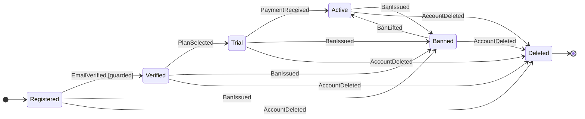

[日本語版はこちら / Japanese](README-ja.md)

# Tenure

Event-sourced entity lifecycle engine — **Java 21+, zero dependencies.**

Entities where **invalid lifecycles cannot exist** — enforced at build time by [8-item validation](#8-item-build-validation), with full event sourcing: idempotency, compensation, and time travel.

> **Tenure** = the right to hold something for a long time. Your entities live for years — tramli flows complete in seconds. Tenure is [tramli](https://github.com/opaopa6969/tramli) extended to the time axis.

---

## Table of Contents

- [Why Tenure exists](#why-tenure-exists)
- [tramli vs Tenure](#tramli-vs-tenure) — feature comparison
- [Quick Start](#quick-start) — define, create, apply, query
- [Core Concepts](#core-concepts) — the 7 building blocks
  - [TenureEvent](#tenureevent) — immutable event with ID
  - [EventGuard](#eventguard) — validates events before applying (pure function)
  - [EntityDefinition](#entitydefinition) — the entire lifecycle as a declarative map
  - [EntityInstance](#entityinstance) — a live entity with event log
  - [LifecycleGraph](#lifecyclegraph) — static lifecycle analysis
  - [MermaidGenerator](#mermaidgenerator) — code = diagram, always
  - [Entry/Exit Actions](#entryexit-actions) — lifecycle callbacks
- [8-Item Build Validation](#8-item-build-validation) — what `build()` checks
- [Event Guards](#event-guards) — pre-apply validation
- [Event Sourcing](#event-sourcing) — what tramli can't do
  - [Idempotency](#idempotency) — P3
  - [Compensation](#compensation) — P4
  - [Time Travel](#time-travel) — stateAtVersion
  - [Rebuild](#rebuild) — state reconstruction
- [Mermaid Diagram Generation](#mermaid-diagram-generation) — code = diagram, always
- [Lifecycle Graph](#lifecycle-graph) — automatic lifecycle dependency analysis
- [Why LLMs Love This](#why-llms-love-this)
- [Use Cases](#use-cases)
- [Glossary](#glossary)

---

## Why Tenure exists

tramli models **flows that complete** — an order goes from CREATED to SHIPPED and is done. But real-world entities **live for years**:

```
User account: Registered → Verified → Active → Banned → Active → Deleted
  ↑ years of events, not seconds of transitions

Order flow (tramli): CREATED → PAYMENT_PENDING → SHIPPED → done
  ↑ completes in minutes, FlowContext is discarded
```

Tenure brings tramli's build-time safety to entities that accumulate events over their lifetime. The event log is the source of truth — state is always derived.

The core insight from [DGE sessions](https://github.com/opaopa6969/tramli/tree/main/dge): **"Data-flow verification is orthogonal to state management paradigm."** It works on mutable contexts (tramli), event logs (Tenure), and Statecharts alike. Tenure proves this by applying tramli's validation to event-sourced entities.

---

## tramli vs Tenure

| Feature | tramli | Tenure |
|---------|--------|--------|
| Build-time validation (8 checks) | Yes | **Yes** |
| Guard validation | TransitionGuard | **EventGuard** |
| Entry/exit actions | Yes | **Yes** |
| Graph analysis | DataFlowGraph | **LifecycleGraph** |
| Mermaid generation | Yes | **Yes** |
| Event sourcing | No | **Yes** (P5) |
| Idempotency | No | **Yes** (P3) |
| Compensation | No | **Yes** (P4) |
| Time travel | No | **Yes** (stateAtVersion) |
| State reconstruction | No | **Yes** (rebuild) |
| Terminal state enforcement | Yes | **Yes** |
| Zero dependencies | Yes | **Yes** |

**Tenure is a superset of tramli.** Everything tramli guarantees at build time, Tenure also guarantees — plus event sourcing.

---

## Quick Start

### 1. Define [events](#tenureevent)

```java
record EmailVerified(String eventId, String email) implements TenureEvent {}
record PlanSelected(String eventId, String plan) implements TenureEvent {}
record BanIssued(String eventId, String reason) implements TenureEvent {}
record BanLifted(String eventId) implements TenureEvent {}
record AccountDeleted(String eventId) implements TenureEvent {}
```

Every event has an `eventId()` for [idempotency](#idempotency). Same ID = same event = skip.

### 2. Define the [entity lifecycle](#entitydefinition)

```java
var userDef = Tenure.define("User", UserState::empty, "Registered")
    .terminal("Deleted")
    .onStateEnter("Banned", s -> auditLog.record("user banned"))
    .on(EmailVerified.class).from("Registered").to("Verified")
        .guard((state, event) -> event.email().contains("@")
            ? GuardResult.accepted() : GuardResult.rejected("Invalid email"))
        .apply((state, event) -> state.withEmail(event.email()))
    .on(PlanSelected.class).from("Verified").to("Trial")
        .apply((state, event) -> state.withPlan(event.plan()))
    .on(BanIssued.class).fromAny().to("Banned")
        .apply((state, event) -> state.withBan(event.reason()))
        .compensate(BanLifted.class)
    .on(BanLifted.class).from("Banned").to("Active")
        .apply((state, event) -> state.unbanned())
    .on(AccountDeleted.class).fromAny().to("Deleted")
        .apply((state, event) -> state)
    .build();  // ← 8-item validation here
```

Read this top-to-bottom — it **is** the lifecycle. No other file needed to understand the structure.

### 3. Create and use

```java
var user = Tenure.create(userDef, "user-001");
user.apply(new EmailVerified("ev-1", "alice@example.com"));
user.apply(new PlanSelected("ev-2", "pro"));

// Idempotent: same eventId is silently ignored
user.apply(new EmailVerified("ev-1", "alice@example.com")); // no-op
```

### 4. Time travel (tramli can't do this)

```java
var v1 = user.stateAtVersion(1);   // state after 1st event
var v0 = user.stateAtVersion(0);   // initial state
String name = user.stateNameAtVersion(2); // "Trial"
```

### 5. Analyze the [lifecycle](#lifecycle-graph)

```java
var graph = userDef.lifecycleGraph();
graph.reachableFrom("Registered");          // → {Verified, Trial, Active, ...}
graph.eventsAt("Verified");                 // → {PlanSelected, BanIssued, AccountDeleted}
graph.impactOf(BanIssued.class);            // → affects 5+ states
graph.shortestPath("Registered", "Active"); // → [EmailVerified, PlanSelected, PaymentReceived]
graph.deadStates();                         // → {} (none)
```

### 6. Generate [Mermaid diagram](#mermaid-diagram-generation)

```java
String mermaid = userDef.toMermaid();
```



This diagram is generated **from code** — it can never be out of date.

---

## Core Concepts

Tenure has 7 building blocks. Each is small, focused, and testable in isolation.

### TenureEvent

The base interface for all events. Every event has an ID for [idempotency](#idempotency) and a name for routing.

```java
public interface TenureEvent {
    String eventId();                        // unique, for idempotency
    default String eventName() {             // for routing, defaults to class name
        return getClass().getSimpleName();
    }
}
```

Events are **immutable value objects** — typically Java records. The `eventId` is the deduplication key: if the same ID is applied twice, the second is silently ignored.

### EventGuard

Validates an event **before** it is applied. A **pure function** — no I/O, no side effects, no state mutation. Equivalent to tramli's `TransitionGuard`.

```java
@FunctionalInterface
public interface EventGuard<S, E extends TenureEvent> {
    GuardResult validate(S state, E event);

    sealed interface GuardResult {
        record Accepted() implements GuardResult {}
        record Rejected(String reason) implements GuardResult {}
    }
}
```

The `sealed interface` means the [EntityInstance](#entityinstance) handles exactly 2 cases — the compiler enforces this via `switch`. No forgotten edge cases.

**Accepted** → event is applied, state transitions.
**Rejected** → event ID is **not consumed** — the same event can be retried with corrected data.

### EntityDefinition

The **single source of truth** for an entity's lifecycle. A declarative transition table built with a fluent DSL and validated at `build()`.

```java
var def = Tenure.define("Order", OrderState::empty, "Created")
    .terminal("Shipped", "Cancelled")
    .onStateEnter("Paid", s -> metrics.increment("paid-orders"))
    .on(OrderPlaced.class).from("Created").to("Pending")
        .apply((s, e) -> s.withItem(e.item()))
    .on(PaymentReceived.class).from("Pending").to("Paid")
        .guard((s, e) -> e.amount() >= s.required()
            ? GuardResult.accepted() : GuardResult.rejected("Insufficient"))
        .apply((s, e) -> s.markPaid())
    .on(OrderShipped.class).from("Paid").to("Shipped")
        .apply((s, e) -> s)
    .on(OrderCancelled.class).fromAny().to("Cancelled")
        .apply((s, e) -> s.cancelled(e.reason()))
    .build();  // ← 8-item validation here
```

Reading this is like reading a map — you see the entire lifecycle in 15 lines. The map IS the code.

### EntityInstance

A live entity with an append-only event log. State is **always derived**: `state = fold(initialState, events)`.

```java
var order = Tenure.create(orderDef, "order-001");
order.apply(new OrderPlaced("ev-1", "Widget", 100));

order.state();          // current state object
order.stateName();      // "Pending"
order.version();        // 1 (number of applied events)
order.eventLog();       // immutable list of EventRecords
order.isTerminal();     // false
order.stateAtVersion(0); // initial state (time travel)
```

`apply()` returns a sealed `ApplyResult`:

| Result | Meaning |
|--------|---------|
| `Applied` | Event accepted, state transitioned |
| `Duplicate` | Same eventId already seen — idempotent skip |
| `NoHandler` | No handler for this event in current state |
| `Terminal` | Entity is in a terminal state — no more transitions |
| `Rejected(reason)` | [Guard](#eventguard) rejected the event |

### LifecycleGraph

Static analysis of an entity's lifecycle, analogous to tramli's `DataFlowGraph`. Built automatically via `def.lifecycleGraph()`. See [Lifecycle Graph](#lifecycle-graph) for the full API.

### MermaidGenerator

Generates Mermaid diagrams from [EntityDefinition](#entitydefinition). See [Mermaid Diagram Generation](#mermaid-diagram-generation).

### Entry/Exit Actions

Lifecycle callbacks that fire on state transitions. Useful for metrics, audit logging, and side effects.

```java
.onStateEnter("Banned", state -> auditLog.record("banned: " + state.banReason()))
.onStateExit("Active", state -> metrics.decrement("active-users"))
```

Actions are **not re-executed** during [rebuild()](#rebuild) — they are side effects, not state derivation. This is by design: replay must be pure.

---

## 8-Item Build Validation

`build()` runs 8 structural checks. If any fail, you get a clear error message with an error code — **before any event is applied.**

| # | Check | What it catches |
|---|-------|----------------|
| 1 | All non-terminal states [reachable](#reachable) from [initial](#initial-state) | Dead states that can never be entered |
| 2 | Path from [initial](#initial-state) to [terminal](#terminal-state) exists | Entities that can never complete |
| 3 | No ambiguous handlers (same event type + same source state) | "Which handler fires?" confusion |
| 4 | [Compensation](#compensation) events have handlers | Broken compensation chains |
| 5 | [Terminal](#terminal-state) states have no outgoing transitions | States that should be final but aren't |
| 6 | All target states are known | Dangling references from typos |
| 7 | [Initial state](#initial-state) valid and not terminal | Missing/broken start |
| 8 | `fromAny` shadowing detection (warning) | Hidden handler priority bugs |

**This is why LLMs can safely generate Tenure code** — even if the generated lifecycle is wrong, `build()` rejects it immediately. The feedback loop is: generate → compile → build() → fix. No runtime surprises.

---

## Event Guards

Guards validate events **before** they are applied — pure functions with no side effects:

```java
.on(PaymentReceived.class).from("Pending").to("Paid")
    .guard((state, event) -> event.amount() >= state.requiredAmount()
        ? EventGuard.GuardResult.accepted()
        : EventGuard.GuardResult.rejected("Insufficient: need " + state.requiredAmount()))
    .apply((state, event) -> state.markPaid())
```

If a guard rejects:
- The event ID is **not consumed** — the same event can be retried
- State does not change
- `ApplyResult.Rejected` is returned with the reason string

---

## Event Sourcing

These features exist in Tenure but **not in tramli**. They are the reason Tenure is a superset, not just a port.

### Idempotency

**P3: Same event ID = same event = skip.**

```java
user.apply(new EmailVerified("ev-1", "alice@example.com")); // → Applied
user.apply(new EmailVerified("ev-1", "alice@example.com")); // → Duplicate (no-op)
user.apply(new EmailVerified("ev-1", "bob@example.com"));   // → Duplicate (still no-op)
```

The `eventId` is the deduplication key. Once an event is applied, the same ID is forever ignored — regardless of payload. This is essential for at-least-once delivery systems (webhooks, message queues).

### Compensation

**P4: Undo by appending, not by rolling back.**

```java
.on(BanIssued.class).fromAny().to("Banned")
    .apply((s, e) -> s.withBan(e.reason()))
    .compensate(BanLifted.class)               // ← registers compensation
.on(BanLifted.class).from("Banned").to("Active")
    .apply((s, e) -> s.unbanned())
```

Compensation events are forward events — they don't delete the original event from the log. The audit trail remains complete. [Build validation](#8-item-build-validation) ensures compensation events have handlers (Check #4).

### Time Travel

**State at any point in history:**

```java
user.apply(new EmailVerified("ev-1", "alice@example.com"));
user.apply(new PlanSelected("ev-2", "pro"));
user.apply(new PaymentReceived("ev-3", 1000));

var v0 = user.stateAtVersion(0);   // initial (no events applied)
var v1 = user.stateAtVersion(1);   // after EmailVerified
var v2 = user.stateAtVersion(2);   // after PlanSelected

String s = user.stateNameAtVersion(1); // "Verified"
```

This is only possible with event sourcing — tramli discards intermediate state. Useful for auditing, debugging, and compliance.

### Rebuild

**Reconstruct state from the event log:**

```java
// After deserialization, event log is restored but state is stale
user.rebuild();
// State is now consistent with event log: state == fold(initial, events)
```

`rebuild()` replays all events through their handlers. Guards and entry/exit actions are **not re-executed** — rebuild is pure state derivation.

---

## Mermaid Diagram Generation

```java
// State transition diagram
String stateDiagram = definition.toMermaid();

// Event flow diagram (flowchart)
String eventFlow = MermaidGenerator.generateEventFlow(definition);
```

The diagram is generated **from the [EntityDefinition](#entitydefinition)** — the same object that the engine uses. It cannot be out of date.

Features:
- Terminal states shown with `[*]` end markers
- Guards annotated with `[guarded]`
- `fromAny` transitions expanded to all non-terminal source states
- Entry/exit actions shown as notes
- Compensation relationships shown as notes

---

## Lifecycle Graph

Every `build()` enables a **LifecycleGraph** — a directed graph of states and transitions derived from [EventHandler](#entitydefinition) declarations. Access it via `def.lifecycleGraph()`.

### Query API

```java
LifecycleGraph graph = definition.lifecycleGraph();

// Reachability
graph.reachableFrom("Registered");   // forward BFS — what states can be reached?
graph.reachesTo("Shipped");          // backward BFS — what states lead here?
graph.deadStates();                  // unreachable from initial
graph.orphanStates();                // no incoming transitions (except initial)

// Event analysis
graph.eventsAt("Pending");           // what events can fire at this state?
graph.allEventTypes();               // all event types in the lifecycle
graph.transitionsFor(BanIssued.class); // all transitions for this event

// Impact analysis
Impact impact = graph.impactOf(PaymentReceived.class);
// → Impact(eventType, affectedStates, transitionCount)

// Path analysis
graph.shortestPath("Created", "Shipped");  // shortest event sequence
graph.requiredEventsTo("Paid");            // events on shortest path from initial

// Guard analysis
graph.guardedTransitions();          // which transitions have guards?
```

### Full API Reference

| Method | Returns | Description |
|--------|---------|-------------|
| `allStates()` | `Set<String>` | All states in the lifecycle |
| `initialState()` | `String` | The initial state |
| `terminalStates()` | `Set<String>` | Terminal states (lifecycle endpoints) |
| `reachableFrom(state)` | `Set<String>` | States reachable via forward BFS |
| `reachesTo(state)` | `Set<String>` | States that can reach this state (backward BFS) |
| `deadStates()` | `Set<String>` | States unreachable from initial |
| `orphanStates()` | `Set<String>` | States with no incoming transitions |
| `eventsAt(state)` | `Set<Class<?>>` | Event types that can fire at a state |
| `allEventTypes()` | `Set<Class<?>>` | All event types used |
| `transitionsFor(eventType)` | `List<Transition>` | Transitions triggered by this event |
| `outgoingFrom(state)` | `List<Transition>` | All outgoing transitions from a state |
| `incomingTo(state)` | `List<Transition>` | All incoming transitions to a state |
| `impactOf(eventType)` | `Impact` | States affected if this event type changes |
| `shortestPath(from, to)` | `List<Transition>` | Shortest transition sequence between states |
| `requiredEventsTo(state)` | `List<Class<?>>` | Events on shortest path from initial |
| `guardedTransitions()` | `List<Transition>` | Transitions with guards |

### Why This Matters

| Without lifecycle graph | With lifecycle graph |
|------------------------|---------------------|
| "What events can happen at state X?" → read all handlers | `graph.eventsAt(X)` |
| "If I change BanIssued, what breaks?" → grep | `graph.impactOf(BanIssued.class)` |
| "Are there dead states?" → manual review | `graph.deadStates()` |
| "What's the minimum path to reach Paid?" → trace by hand | `graph.requiredEventsTo("Paid")` |

---

## Why LLMs Love This

| Problem with procedural code | How Tenure solves it |
|------------------------------|---------------------|
| "Read 1800 lines to find the event handler" | Read the [EntityDefinition](#entitydefinition) (20 lines) |
| "Will my change break something?" | [LifecycleGraph.impactOf()](#lifecycle-graph) |
| "I generated a wrong state transition" | [build()](#8-item-build-validation) rejects it |
| "The lifecycle diagram is outdated" | [Generated from code](#mermaid-diagram-generation) |
| "I forgot to handle idempotency" | [Built-in](#idempotency) — `eventId` dedup is automatic |
| "How do I undo a ban?" | [Compensation](#compensation) is declarative |

**The key principle: LLMs hallucinate, but compilers and `build()` don't.**

---

## Use Cases

Tenure works for any system with **entities that live for years** and accumulate events:

- **User accounts** — register → verify → activate → suspend → reactivate → delete
- **Subscriptions** — trial → active → past due → cancelled → renewed
- **Orders** — placed → paid → shipped → returned → refunded
- **Support tickets** — open → assigned → escalated → resolved → reopened → closed
- **Devices / IoT** — provisioned → active → firmware update → decommissioned
- **Compliance** — submitted → under review → approved → audit → expired

For **short-lived flows** that complete in seconds/minutes (OAuth, payment checkout), use [tramli](https://github.com/opaopa6969/tramli). For **long-lived entities** that accumulate history, use Tenure.

---

## Glossary

| Term | Definition |
|------|-----------|
| <a id="compensation-event"></a>**Compensation event** | An event that reverses the effect of a prior event. Registered via `.compensate()`. [Build validation](#8-item-build-validation) ensures it has a handler. |
| <a id="entity-definition"></a>**EntityDefinition** | Immutable, validated description of an entity's lifecycle. Built via fluent DSL, verified at [build()](#8-item-build-validation). The "map" of the lifecycle. |
| <a id="entity-instance"></a>**EntityInstance** | A single live entity. Has an ID, event log, derived state, and current state name. |
| <a id="event-log"></a>**Event log** | Append-only list of [EventRecords](#entityinstance). The source of truth — state is always derived from this via `fold`. |
| <a id="event-sourcing-def"></a>**Event sourcing** | Pattern where state is derived from a sequence of events rather than stored directly. Enables [time travel](#time-travel) and [rebuild](#rebuild). |
| <a id="from-any"></a>**fromAny** | A handler that fires from any non-terminal state. Used for cross-cutting events like bans or deletions. Specific handlers take precedence over fromAny. |
| <a id="guard-result"></a>**GuardResult** | The `sealed interface` returned by an [EventGuard](#eventguard). Exactly 2 variants: `Accepted` (proceed) and `Rejected(reason)` (block). |
| <a id="initial-state"></a>**Initial state** | The state where an entity begins. Declared as the third argument to `Tenure.define()`. Must not be [terminal](#terminal-state). |
| <a id="reachable"></a>**Reachable** | A state that can be entered from the [initial state](#initial-state) via some sequence of events. Unreachable non-terminal states cause [build()](#8-item-build-validation) failure. |
| <a id="terminal-state"></a>**Terminal state** | A state where the entity's lifecycle ends. No outgoing transitions allowed. Declared via `.terminal()`. |
| <a id="time-travel-def"></a>**Time travel** | Reconstructing entity state at any historical version via `stateAtVersion(n)`. Only possible with [event sourcing](#event-sourcing-def). |

---

## Requirements

| Language | Version | Dependencies |
|----------|---------|-------------|
| Java | 21+ | Zero |

## Origin

Tenure was designed by Pat Helland (as a character) in a [DGE dialogue session](https://github.com/opaopa6969/tramli/tree/main/dge), exploring what a distributed systems expert would build if tasked with creating a state management library. The session confirmed: when you add data-flow verification to an event-sourced entity system and remove unnecessary complexity, the design converges to tramli's core. Tenure takes the next step: **tramli's safety + event sourcing's power.**

## License

MIT
